# Borbodhu Canonical Schema

## Goal

Define the target data model for the rebuilt Borbodhu platform so development and migration can work from one shared structure.

## Core design choices

1. Separate authentication identity from role-specific profile data.
2. Separate mutable profile drafts from approved public profile projections.
3. Model interactions explicitly instead of overloading one table.
4. Model privacy as policy, not just a UI toggle.
5. Support English and Bangla content separately.
6. Keep payments, subscriptions, credits, and manual approvals as first-class entities.

## Entity overview

```mermaid
erDiagram
  USERS ||--o{ USER_ROLES : has
  USERS ||--o| MEMBER_PROFILES : owns
  USERS ||--o| GHOTOK_PROFILES : owns
  USERS ||--o| VENDOR_PROFILES : owns
  MEMBER_PROFILES ||--o{ PROFILE_MEDIA : has
  MEMBER_PROFILES ||--o| PARTNER_PREFERENCES : has
  MEMBER_PROFILES ||--o{ PROFILE_REVISIONS : has
  MEMBER_PROFILES ||--o{ PHOTO_ACCESS_REQUESTS : receives
  MEMBER_PROFILES ||--o{ CONTACT_UNLOCKS : owns
  MEMBER_PROFILES ||--o{ INTERACTIONS : sends_or_receives
  MEMBER_PROFILES ||--o{ PROFILE_VISITS : receives
  MEMBER_PROFILES ||--o{ SEARCH_SAVES : owns
  MEMBER_PROFILES ||--o{ WEDDING_PROJECTS : owns
  GHOTOK_PROFILES ||--o{ GHOTOK_MEMBER_LINKS : manages
  GHOTOK_PROFILES ||--o{ GHOTOK_CREDIT_LEDGER : owns
  VENDOR_PROFILES ||--o{ VENDOR_PACKAGES : offers
  VENDOR_PROFILES ||--o{ VENDOR_LEADS : receives
  MEMBERSHIP_PLANS ||--o{ MEMBERSHIPS : defines
  USERS ||--o{ MEMBERSHIPS : buys
  PAYMENTS ||--o{ PAYMENT_ITEMS : contains
  COUPONS ||--o{ COUPON_REDEMPTIONS : tracks
  CONVERSATIONS ||--o{ CONVERSATION_PARTICIPANTS : contains
  CONVERSATIONS ||--o{ MESSAGES : has
```

## Identity and access

### `users`

Purpose:

- authentication identity
- login email
- password hash
- password hash version
- account state
- locale preference
- last login

Suggested fields:

- `id`
- `email`
- `email_verified_at`
- `password_hash`
- `password_hash_algo`
- `legacy_hash`
- `legacy_hash_type`
- `status`
- `preferred_locale`
- `created_at`
- `updated_at`
- `last_login_at`

### `user_roles`

Purpose:

- assign one or more roles to each identity

Suggested values:

- `member`
- `ghotok`
- `vendor`
- `admin`
- `super_admin`

## Member domain

### `member_profiles`

Purpose:

- current canonical profile state for a member

Suggested fields:

- `id`
- `user_id`
- `display_id`
- `status`
- `approval_status`
- `profile_owner_type`
- `managed_by_ghotok_id`
- `created_by_actor_type`
- `created_by_actor_id`
- `first_name`
- `last_name`
- `display_name`
- `gender`
- `looking_for`
- `birth_date`
- `marital_status`
- `children_status`
- `height_cm`
- `body_type`
- `complexion`
- `blood_group`
- `special_case_notes`
- `religion`
- `religion_subgroup`
- `community_type`
- `mother_tongue`
- `family_values`
- `education_level`
- `education_major`
- `university_name`
- `profession`
- `designation`
- `annual_income_band`
- `diet`
- `smoke`
- `drink`
- `current_country_code`
- `current_city`
- `current_area`
- `residence_status`
- `home_country_code`
- `home_division`
- `home_district`
- `family_details`
- `about_me`
- `guardian_name`
- `guardian_relation`
- `guardian_phone`
- `guardian_email`
- `family_involvement_level`
- `mahr_preference`
- `gotra`
- `relocation_preference`
- `is_profile_public`
- `indexing_mode`
- `contact_visibility_mode`
- `profile_completion_percent`
- `approved_at`
- `approved_by_admin_id`
- `created_at`
- `updated_at`

### `profile_revisions`

Purpose:

- draft and moderation history

Suggested fields:

- `id`
- `member_profile_id`
- `revision_number`
- `submitted_payload_json`
- `submitted_by_user_id`
- `review_status`
- `review_notes`
- `reviewed_by_admin_id`
- `submitted_at`
- `reviewed_at`

### `partner_preferences`

Purpose:

- structured match criteria

Suggested fields:

- `id`
- `member_profile_id`
- `gender`
- `age_min`
- `age_max`
- `marital_statuses`
- `children_preferences`
- `height_min_cm`
- `height_max_cm`
- `religions`
- `religion_subgroups`
- `mother_tongues`
- `family_values`
- `education_levels`
- `education_majors`
- `professions`
- `diet_preferences`
- `smoke_preferences`
- `drink_preferences`
- `home_country_codes`
- `living_country_codes`
- `districts`
- `residence_statuses`
- `relocation_preferences`
- `family_involvement_preferences`
- `about_partner`
- `updated_at`

### `profile_media`

Purpose:

- profile photos, biodata, and verification documents

Suggested fields:

- `id`
- `member_profile_id`
- `media_type`
- `storage_path`
- `thumbnail_path`
- `mime_type`
- `privacy_mode`
- `is_primary`
- `approval_status`
- `approved_by_admin_id`
- `uploaded_by_user_id`
- `created_at`
- `updated_at`

### `photo_access_requests`

Purpose:

- request and approval flow for private photos

Suggested fields:

- `id`
- `owner_member_profile_id`
- `requester_member_profile_id`
- `request_type`
- `status`
- `decision_by_user_id`
- `decision_reason`
- `created_at`
- `decided_at`

## Interaction domain

### `interactions`

Purpose:

- one normalized table for interest, favorite, and block style actions

Suggested fields:

- `id`
- `actor_member_profile_id`
- `target_member_profile_id`
- `interaction_type`
- `status`
- `created_at`
- `updated_at`

Interaction types:

- `interest`
- `favorite`
- `block`

### `profile_visits`

Purpose:

- track profile visits and visit summaries

Suggested fields:

- `id`
- `viewer_member_profile_id`
- `viewed_member_profile_id`
- `source`
- `created_at`

### `contact_unlocks`

Purpose:

- record visibility of paid contact information

Suggested fields:

- `id`
- `viewer_member_profile_id`
- `target_member_profile_id`
- `membership_id`
- `unlock_source`
- `created_at`

## Messaging domain

### `conversations`

Suggested fields:

- `id`
- `conversation_type`
- `created_at`
- `updated_at`

### `conversation_participants`

Suggested fields:

- `id`
- `conversation_id`
- `user_id`
- `member_profile_id`
- `joined_at`
- `last_read_message_id`
- `is_active`

### `messages`

Suggested fields:

- `id`
- `conversation_id`
- `sender_user_id`
- `sender_member_profile_id`
- `message_type`
- `body`
- `attachment_path`
- `sent_at`
- `delivered_at`
- `read_at`
- `deleted_at`

## Search domain

### `search_saves`

Suggested fields:

- `id`
- `member_profile_id`
- `name`
- `criteria_json`
- `last_run_at`
- `alert_enabled`
- `created_at`
- `updated_at`

### `member_search_documents`

Purpose:

- denormalized search projection table

Suggested fields:

- `member_profile_id`
- `approval_status`
- `activity_score`
- `premium_score`
- `joined_at`
- `last_active_at`
- `has_public_photo`
- `has_private_photo`
- `country_tokens`
- `district_tokens`
- `religion_tokens`
- `profession_tokens`
- `search_payload_json`
- `compatibility_hint_text_en`
- `compatibility_hint_text_bn`

## Commerce domain

### `membership_plans`

Suggested fields:

- `id`
- `code`
- `name_en`
- `name_bn`
- `duration_days`
- `bdt_price`
- `usd_price`
- `contact_limit`
- `message_enabled`
- `contact_view_enabled`
- `highlight_enabled`
- `support_tier`
- `is_active`
- `sort_order`

### `memberships`

Suggested fields:

- `id`
- `user_id`
- `member_profile_id`
- `membership_plan_id`
- `status`
- `starts_at`
- `ends_at`
- `source_payment_id`
- `created_at`
- `updated_at`

### `payments`

Suggested fields:

- `id`
- `user_id`
- `actor_type`
- `actor_id`
- `payment_for_type`
- `payment_for_id`
- `gateway`
- `gateway_reference`
- `currency`
- `subtotal_amount`
- `discount_amount`
- `final_amount`
- `status`
- `approved_by_admin_id`
- `approved_at`
- `metadata_json`
- `created_at`
- `updated_at`

### `payment_items`

Suggested fields:

- `id`
- `payment_id`
- `item_type`
- `item_id`
- `amount`

### `coupons`

Suggested fields:

- `id`
- `code`
- `discount_type`
- `amount`
- `percent`
- `currency_scope`
- `applies_to`
- `max_total_uses`
- `max_uses_per_user`
- `starts_at`
- `expires_at`
- `is_active`
- `created_by_admin_id`
- `notes`

### `coupon_redemptions`

Suggested fields:

- `id`
- `coupon_id`
- `user_id`
- `payment_id`
- `currency`
- `subtotal_amount`
- `discount_amount`
- `final_amount`
- `redeemed_at`

## Ghotok domain

### `ghotok_profiles`

Suggested fields:

- `id`
- `user_id`
- `display_name`
- `email`
- `phone`
- `address`
- `gender`
- `status`
- `fee_currency`
- `fee_amount`
- `bio_en`
- `bio_bn`
- `photo_path`
- `created_at`
- `updated_at`

### `ghotok_member_links`

Suggested fields:

- `id`
- `ghotok_profile_id`
- `member_profile_id`
- `link_status`
- `created_at`

### `ghotok_credit_wallets`

Suggested fields:

- `id`
- `ghotok_profile_id`
- `balance`
- `updated_at`

### `ghotok_credit_ledger`

Suggested fields:

- `id`
- `ghotok_profile_id`
- `entry_type`
- `amount`
- `balance_after`
- `reference_type`
- `reference_id`
- `notes`
- `created_by_admin_id`
- `created_at`

### `impersonation_sessions`

Suggested fields:

- `id`
- `ghotok_profile_id`
- `member_profile_id`
- `started_by_user_id`
- `reason`
- `credit_cost`
- `started_at`
- `ended_at`

## Vendor and wedding domain

### `vendor_profiles`

Suggested fields:

- `id`
- `user_id`
- `business_name`
- `slug`
- `category_id`
- `subcategory_id`
- `division`
- `district`
- `area`
- `address`
- `contact_person`
- `phone`
- `email`
- `website`
- `description_en`
- `description_bn`
- `logo_path`
- `status`
- `billing_status`
- `created_at`
- `updated_at`

### `vendor_packages`

Suggested fields:

- `id`
- `vendor_profile_id`
- `name_en`
- `name_bn`
- `description_en`
- `description_bn`
- `price_bdt`
- `is_active`
- `created_at`

### `vendor_media`

Suggested fields:

- `id`
- `vendor_profile_id`
- `storage_path`
- `media_type`
- `sort_order`
- `created_at`

### `vendor_leads`

Suggested fields:

- `id`
- `vendor_profile_id`
- `member_profile_id`
- `wedding_project_id`
- `status`
- `message`
- `created_at`
- `updated_at`

### `wedding_projects`

Suggested fields:

- `id`
- `member_profile_id`
- `title`
- `wedding_date`
- `city`
- `budget_band`
- `guest_target`
- `status`
- `created_at`
- `updated_at`

### `wedding_guest_entries`

Suggested fields:

- `id`
- `wedding_project_id`
- `guest_name`
- `guest_phone`
- `guest_email`
- `guest_address`
- `guest_count`
- `invited`
- `confirmed`
- `created_at`
- `updated_at`

### `wedding_vendor_shortlists`

Suggested fields:

- `id`
- `wedding_project_id`
- `vendor_profile_id`
- `status`
- `notes`
- `created_at`

## Operations domain

### `admin_users`

Suggested fields:

- `id`
- `user_id`
- `display_name`
- `is_super_admin`
- `status`
- `created_at`

### `admin_permissions`

Suggested fields:

- `id`
- `admin_user_id`
- `permission_key`
- `permission_value`

### `audit_logs`

Suggested fields:

- `id`
- `actor_user_id`
- `actor_role`
- `target_type`
- `target_id`
- `action`
- `description`
- `metadata_json`
- `ip_address`
- `created_at`

### `match_mail_rules`

Suggested fields:

- `id`
- `is_enabled`
- `email_enabled`
- `push_enabled`
- `batch_size`
- `max_matches`
- `cooldown_hours`
- `from_email`
- `from_name`
- `email_subject_en`
- `email_subject_bn`
- `created_at`
- `updated_at`

### `match_mail_logs`

Suggested fields:

- `id`
- `receiver_user_id`
- `receiver_email`
- `match_count`
- `email_status`
- `push_status`
- `error_message`
- `created_at`

## Content and localization domain

### `content_pages`

Suggested fields:

- `id`
- `content_type`
- `slug_en`
- `slug_bn`
- `title_en`
- `title_bn`
- `body_en`
- `body_bn`
- `seo_title_en`
- `seo_title_bn`
- `seo_description_en`
- `seo_description_bn`
- `publish_status`
- `created_at`
- `updated_at`

## Status enums to standardize

### Profile status

- `draft`
- `pending_review`
- `active`
- `inactive`
- `rejected`
- `cancelled`
- `deleted`

### Photo privacy

- `public`
- `private`
- `blurred_public`

### Payment status

- `pending`
- `paid`
- `failed`
- `expired`
- `refunded`
- `manual_review`
- `manual_approved`

### Vendor status

- `pending_review`
- `active`
- `inactive`
- `rejected`

## Notes for implementation

- arrays from the legacy schema should become normalized relations or JSON fields with controlled validation
- string enums from legacy tables should be standardized centrally
- every externally visible entity should have soft-delete and audit-aware timestamps where needed
