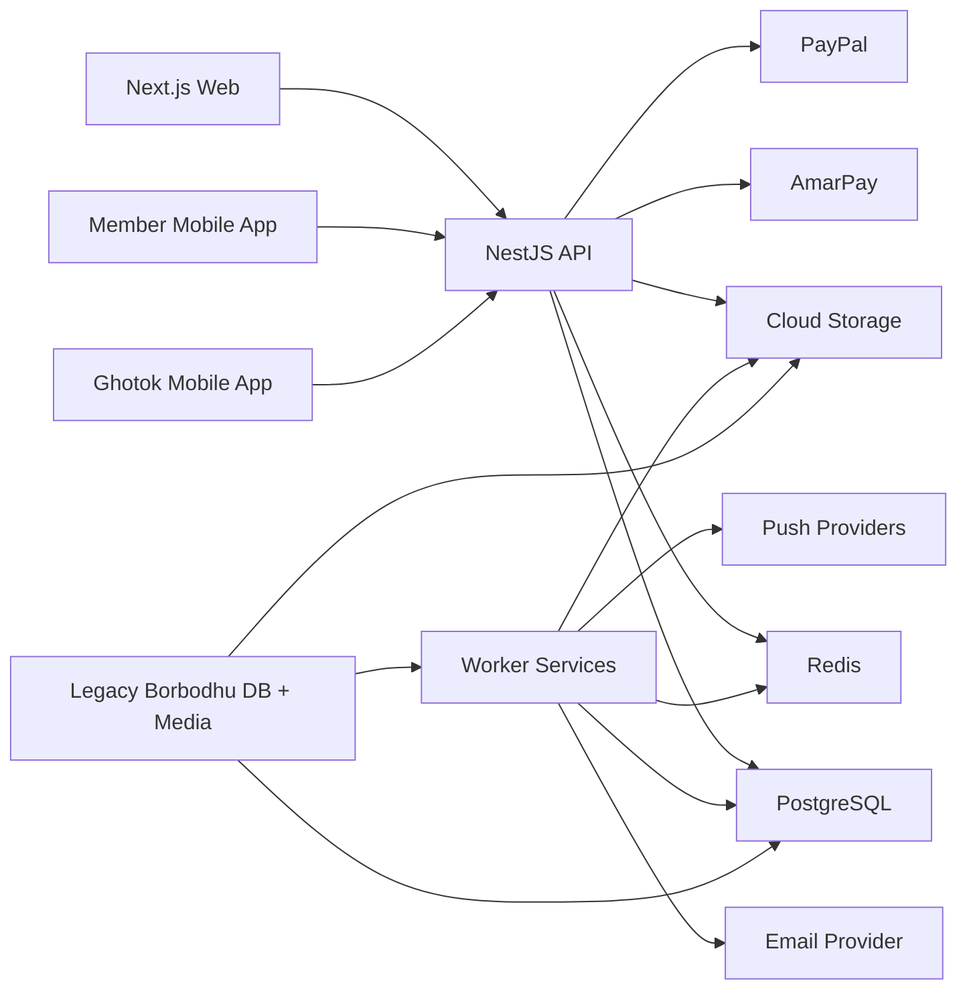

# Borbodhu System Architecture

## Objective

Define the target technical architecture for the new Borbodhu platform across:

- public website
- member web app
- member mobile apps
- ghotok web app
- ghotok mobile apps
- vendor portal
- admin and super admin
- AI-assisted services
- migration from the legacy CodeIgniter platform

## Architecture principles

1. One source of truth for business logic.
2. Mobile and web should share validation and domain rules.
3. Sensitive profile data must be privacy-safe by default.
4. Search, messaging, payments, and photo privacy are core platform services.
5. English and Bangla should be separate route trees backed by the same structured content model.
6. All critical actions must be auditable.
7. Launch 1 should be modular enough to grow without re-architecture.

## Target stack

### Applications

- `apps/web`
  - Next.js public site plus authenticated web portals
- `apps/member-mobile`
  - React Native Expo app for members
- `apps/ghotok-mobile`
  - React Native Expo app for ghotok
- `apps/api`
  - NestJS backend API
- `apps/workers`
  - NestJS worker or lightweight Node worker services for jobs

### Shared packages

- `packages/ui`
  - cross-app design tokens and shared UI primitives
- `packages/types`
  - shared TypeScript DTOs and contracts
- `packages/domain`
  - matching, pricing, permissions, privacy, and workflow rules
- `packages/i18n`
  - English and Bangla copy keys
- `packages/config`
  - environment and feature flag helpers

### Platform services

- PostgreSQL
- Redis
- Google Cloud Storage
- Firebase Cloud Messaging
- Apple Push Notification service
- transactional email provider
- campaign email provider
- AmarPay
- PayPal

## Cost-aware deployment posture

For Borbodhu's year 1 traffic, prefer:

- single primary region
- Cloud Run min instances set to `0` for non-critical services
- one intentionally small Cloud SQL primary instance
- no read replica initially
- no multi-region active-active initially
- CDN in front of public content

This should be revisited only when actual traffic and revenue justify more resilience spend.

## High-level topology



## Runtime architecture

### Web application

The web app contains:

- public marketing pages
- public SEO pages
- public vendor pages
- public ghotok pages
- member portal
- ghotok portal
- vendor portal
- admin portal
- super admin portal

Use route groups and access boundaries, not separate deployments, unless scaling later requires it.

### API application

The API should expose domain modules:

- auth
- members
- profiles
- profile media
- partner preferences
- searches
- matching
- interactions
- mailbox
- notifications
- memberships
- payments
- coupons
- ghotok
- vendors
- wedding planning
- admin moderation
- reporting
- content and SEO
- AI services

### Worker services

Workers handle:

- match mail
- campaign mail
- push notification fanout
- media optimization
- document processing
- fraud checks
- migration ETL
- search projection refresh
- analytics rollups

## Identity and access model

Use one user identity table with role assignments instead of separate login systems.

### Primary identities

- member
- ghotok
- vendor
- admin
- super admin

### Access behavior

- one user can hold multiple roles if allowed by business rules
- impersonation creates a scoped audit session, not a hidden role swap
- admin and super admin use RBAC plus fine-grained permissions

## Auth architecture

### Supported login methods

- email and password
- Google
- Facebook
- password reset by email
- optional OTP later

### Session model

- web: secure httpOnly session or short-lived access token plus refresh token
- mobile: access token plus refresh token
- impersonation: short-lived scoped token with explicit audit metadata

### Password migration

- import legacy hash and hash type when technically safe
- on successful first login, rehash into Argon2id or bcrypt
- fall back to password reset when unsafe or incompatible

## Key bounded contexts

### 1. Profile and identity

Owns:

- member core data
- guardian or family involvement
- religion and cultural fields
- location and diaspora fields
- photos and biodata
- privacy settings
- verification state

### 2. Discovery and matching

Owns:

- quick search
- advanced search
- photo search
- saved searches
- match feed
- compatibility explanations
- activity sort orders

### 3. Interaction and communication

Owns:

- interests
- favorites
- blocks
- visits
- mailbox
- message attachments
- contact unlocks
- photo access requests

### 4. Commerce

Owns:

- membership plans
- subscriptions
- coupons
- payments
- office payment approvals
- ghotok credits
- vendor billing

### 5. Wedding planning and vendor marketplace

Owns:

- wedding projects
- guest lists
- vendor directory
- vendor packages
- shortlist
- inquiries
- lead tracking

### 6. Moderation and operations

Owns:

- review queues
- approval or rejection
- risk scoring
- audit logs
- reports
- match mail configuration
- campaigns

## Data architecture

### Source of truth

PostgreSQL is the system of record.

### Derived data

Use projection tables for:

- search documents
- dashboard counters
- unread counts
- compatibility summaries
- vendor lead summaries
- reporting aggregates

### Media

Store original and derived assets in Cloud Storage:

- profile photos
- private photos
- biodata PDFs
- verification documents
- vendor gallery images

### Media privacy

- public media via CDN-backed public URLs where allowed
- private media via signed URLs
- access checks enforced by API before URL issuance

## Search architecture

Start with PostgreSQL-backed search projections.

### Why

- data size is moderate for Launch 1
- relational filtering is strong
- simpler operations
- easier migration

### Search projection table should include

- member id
- status
- approval status
- gender
- looking for
- age and birth year
- religion and subgroups
- height
- education and profession bands
- location and diaspora tags
- family involvement flags
- photo availability
- privacy eligibility
- last active timestamp
- join date
- premium rank boosts
- AI compatibility summary snapshot

### Future option

If search load or relevance becomes complex, add a dedicated search engine later without changing the source-of-truth model.

## Messaging architecture

### Conversation model

- thread per member pair or contextual conversation
- message records separate from thread metadata
- delivery and read state
- email notification events

### Launch rules

- free members can send interest
- premium permissions control messaging and contact reveal
- blocked users cannot create or continue communication
- photo privacy and contact visibility are enforced before action eligibility

## Payments architecture

### Payment methods

- AmarPay
- PayPal
- office or manual approval

### Payment lifecycle

- quote
- checkout intent
- pending
- paid
- failed
- expired
- refunded
- manually approved

### Plan configurability

Super admin should control:

- duration
- BDT price
- USD price
- contact limits
- messaging permissions
- premium features
- visibility boosts
- supported payment methods

## AI architecture

### Launch 1 AI services

- match explanation service
- onboarding assistant service
- communication helper service
- moderation signal service
- vendor recommendation service

### AI service design

- stateless API workers
- prompt templates stored in versioned config
- audit of generated suggestions where needed
- never auto-commit sensitive decisions without human confirmation

### AI data safety

- do not expose hidden user data in prompts unless strictly required
- redact contact details
- keep admin-only risk notes out of user-facing AI responses

## Notifications architecture

Channels:

- email
- push
- in-app

Event types:

- profile approved
- profile rejected
- photo request
- interest received
- favorite received
- message received
- contact unlocked
- payment approved
- membership expiring
- match mail
- vendor inquiry updates

## Analytics architecture

### Recommended stack

- GA4 for web
- Firebase Analytics for mobile apps
- BigQuery for event export and analytics warehouse
- Looker Studio for product, revenue, and ops dashboards
- Cloud Billing export to BigQuery for FinOps

### Cost-aware recommendation

- use daily BigQuery export first
- avoid streaming export unless near-real-time analysis becomes necessary
- design events carefully to stay efficient

### Key analytics domains

- acquisition
- registration funnel
- approval funnel
- search quality
- interest and messaging
- membership conversion
- Ghotok usage
- vendor leads
- wedding planning usage
- geography and diaspora behavior

## Monetization architecture

Primary revenue:

- memberships
- Ghotok credits
- vendor billing

Secondary revenue:

- AdSense on selected public, lower-risk pages only

Do not serve AdSense in logged-in portals or sensitive user-generated profile-heavy pages.

## Localization architecture

### Product strategy

- separate route trees: `/en/*` and `/bn/*`
- localized copy keys
- locale-specific metadata, schema, and content slugs where relevant

### Content model

Structured content entities should support:

- English title and body
- Bangla title and body
- SEO metadata per locale
- publish state

## Security architecture

### Required controls

- Argon2id or bcrypt for new passwords
- encrypted secrets
- signed file access
- RBAC checks in API layer
- audit logs for sensitive actions
- rate limiting
- CSRF protection for web mutations
- request validation
- file scanning pipeline
- fraud and abuse flagging

### Sensitive action audit

- admin review decisions
- super admin settings changes
- payment approvals
- credit adjustments
- impersonation start and stop
- vendor billing changes
- coupon creation or disable

## Environment strategy

Environments:

- local
- dev
- staging
- production

### Release model

- all migrations run in CI before deployment
- staging mirrors production integrations where possible
- migration dry runs in staging against masked production snapshots

## Monorepo structure

```text
apps/
  web/
  api/
  workers/
  member-mobile/
  ghotok-mobile/
packages/
  ui/
  domain/
  types/
  i18n/
  config/
docs/
```

## Launch readiness criteria

Launch 1 is ready when:

- all critical roles can authenticate
- profile migration passes validation
- message migration for last 6 months is verified
- photo privacy works correctly
- membership and payment flows are production-safe
- wedding planning and vendor inquiries are functional
- Bangla and English routes are complete
- app store builds pass QA
- moderation and audit trails are in place
